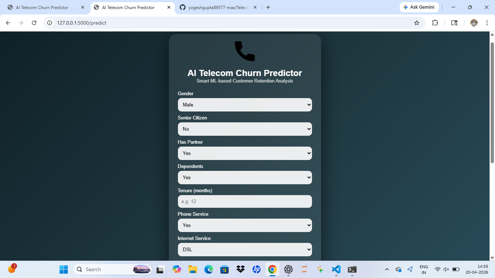

# 📊 AI Telecom Customer Churn Predictor

🚀 A Machine Learning powered web application that predicts whether a telecom customer is likely to **stay or churn**, helping businesses improve customer retention.

---

## 🌟 Project Overview

Customer churn is a major challenge in the telecom industry. This project uses **Machine Learning (CatBoost Classifier)** to analyze customer behavior and predict churn probability.

💡 Built with:

* Machine Learning (Scikit-learn + CatBoost)
* Flask (Backend)
* HTML + CSS (Premium UI)
* Pandas & NumPy

---

## 🖥️ Demo Preview

<p align="center">
  
</p>

---

## 🎯 Features

✔ Predict customer churn probability
✔ Premium and modern UI design
✔ Real-time prediction using trained ML model
✔ Feature engineering (avg spend, contract risk)
✔ Ready for deployment

---

## 🧠 Machine Learning Details

* Model: **CatBoostClassifier**
* Accuracy: **~77%**
* ROC-AUC: **~0.82**
* Dataset: Telecom Customer Churn (Kaggle)

---

## 📂 Project Structure

```
telecom-churn-prediction-ml/
│
├── app.py
├── requirements.txt
├── Procfile
├── churn_model.pkl
├── model_columns.pkl
├── templates/
│   └── index.html
├── app_preview.png
└── README.md
```

---

## ⚙️ Installation & Setup

### 🔹 1. Clone the repository

```
git clone https://github.com/your-username/telecom-churn-prediction-ml.git
cd telecom-churn-prediction-ml
```

### 🔹 2. Create virtual environment

```
python -m venv venv
venv\Scripts\activate   # Windows
```

### 🔹 3. Install dependencies

```
pip install -r requirements.txt
```

### 🔹 4. Run the app

```
python app.py
```

👉 Open in browser:

```
http://127.0.0.1:5000
```

---

## 📊 Input Features

* Gender
* Senior Citizen
* Partner / Dependents
* Tenure
* Phone Service
* Internet Service
* Contract Type
* Monthly Charges
* Total Charges

---

## 🚀 Deployment

This project is ready to deploy on:

* Render
* Railway
* Heroku

---

## 📌 Future Improvements

* 🔥 Increase accuracy to 85%+
* 📊 Add analytics dashboard
* 🤖 Use Deep Learning models
* ☁️ Full cloud deployment with CI/CD

---

## 👨‍💻 Author

**Yogesh Gupta**

---

## ⭐ Support

If you like this project, give it a ⭐ on GitHub!
